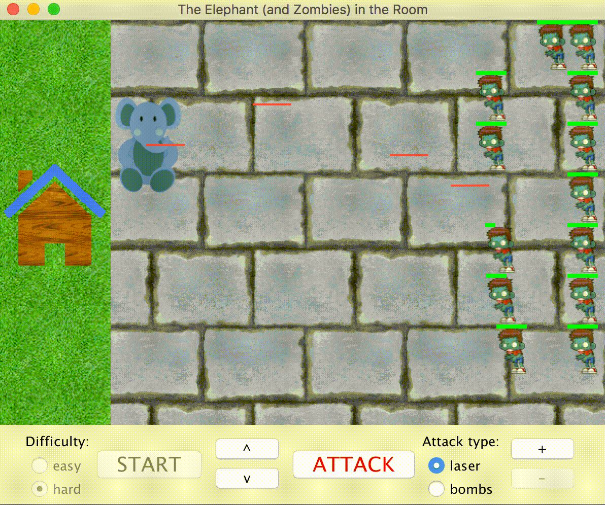

Project done for my Graphical User Interfaces class (COMP86) in which we had to design a game or simulation using Java. Explored concepts of inheritance, UML diagrams, and object-oriented design.

<i class="large github icon "></i>
<a href="https://github.com/will-hodge/elephant-vs-zombies" class="btn">Project repository here</a>

