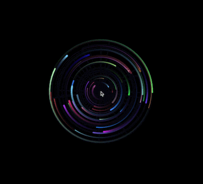

Using what I learned in my Graphical User Interfaces class (COMP 86) to implement a simple canvas that renders particles to orbit the user's mouse.

<a href="https://will-hodge.github.io/mouse-orbs/" class="btn">Project here</a>

<i class="large github icon "></i>
<a href="https://github.com/will-hodge/mouse-orbs" class="btn">Project repository here</a>

