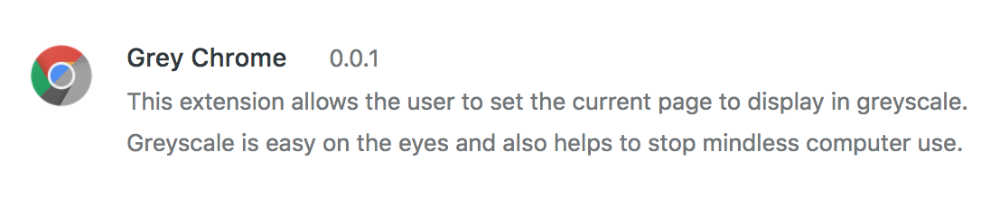
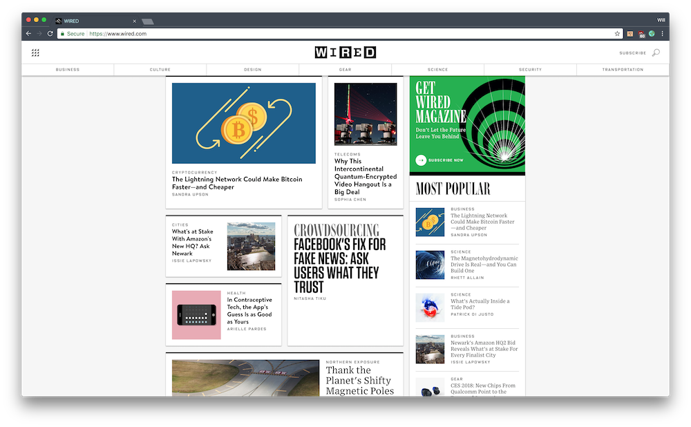
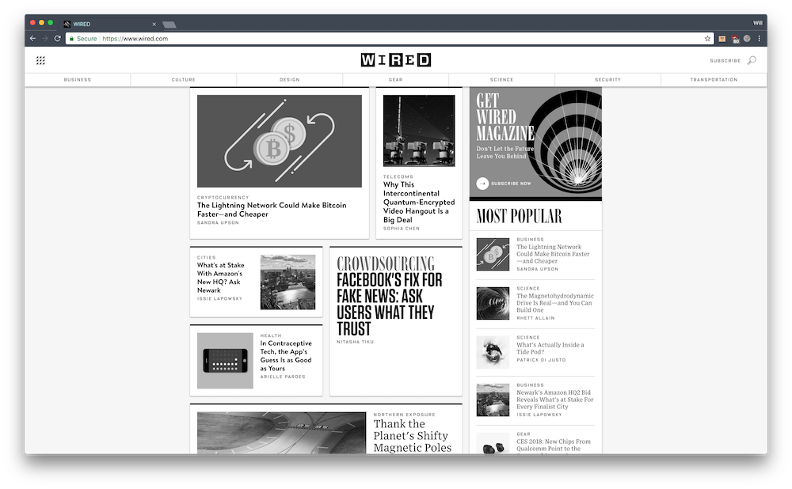

A simple Chrome extension that sits in the menu bar and, when clicked, turns all Chrome tabs to black and white. Clicking the icon activates the extension which turns both the currently open as well as future tabs to greyscale. Clicking the icon again deactivates the greyscale.

Greyscale is easier on the eyes and limits the addictive nature of webpages (see [here](http://www.tristanharris.com/2016/05/how-technology-hijacks-peoples-minds%E2%80%8A-%E2%80%8Afrom-a-magician-and-googles-design-ethicist/)).

**Before:**

**After:**

<i class="large github icon "></i>Project repository <a href="https://github.com/will-hodge/grey-chrome">here</a>.
