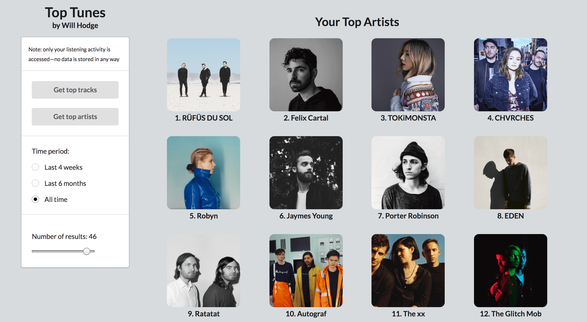

Web app that allows users to sign into their Spotify account and view their top played tracks and artists over various periods of time.

Project [here](https://will-hodge.github.io/top-tunes/).

<i class="large github icon "></i>Project repository <a href="https://github.com/will-hodge/top-tunes">here</a>.
