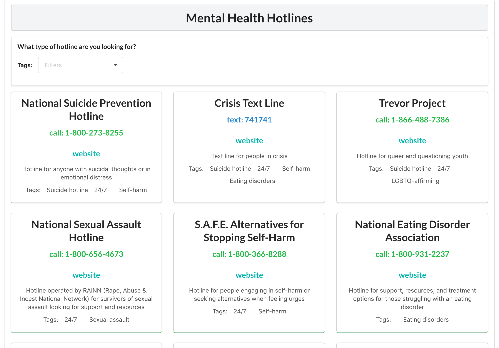
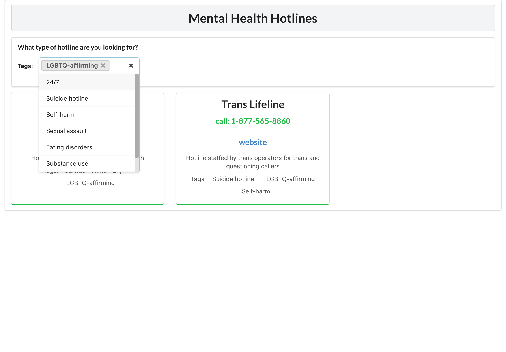

 

 

Simple full-stack web app that allows users to filter through professional mental health hotlines based on their current needs. Uses a React frontend with a Node.js/Express backend with MongoDB data storage. 

<i class="large github icon "></i>Project repository <a href="https://github.com/will-hodge/hotline-finder">here</a>.
