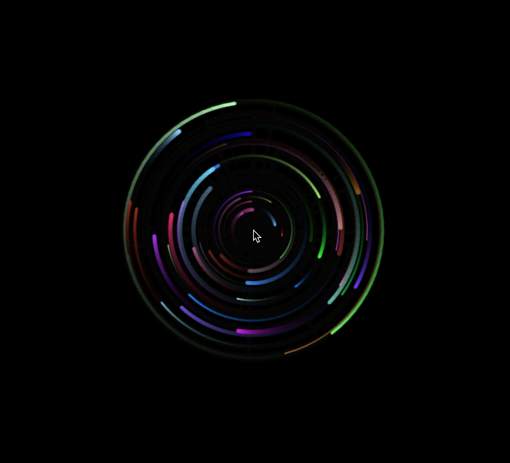

Using what I learned in my Graphical User Interfaces class (COMP 86) to implement a simple canvas that renders particles to orbit the user's mouse.

Project [here](https://will-hodge.github.io/mouse-orbs/).

<i class="large github icon "></i>Project repository <a href="https://github.com/will-hodge/mouse-orbs">here</a>.
