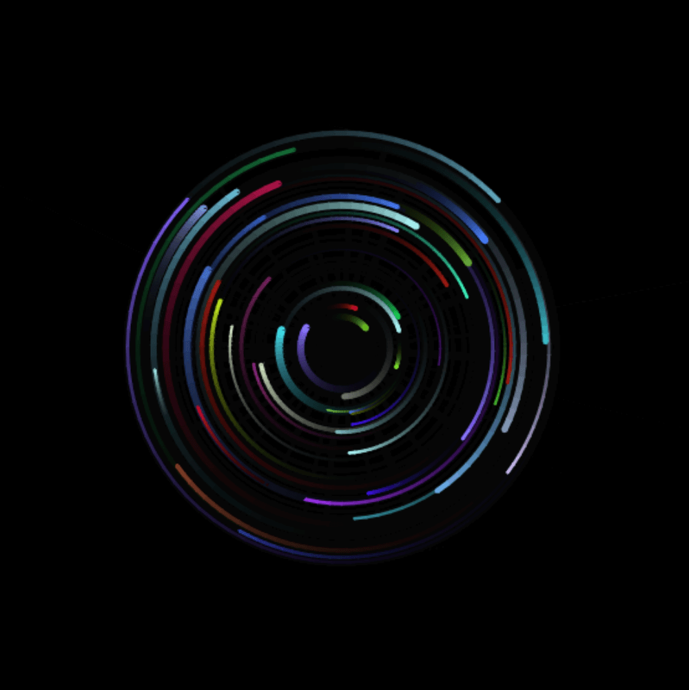

---
layout: project
type: project
image: images/mouseOrbs.png
title: Mouse Orbs
permalink: projects/mouseOrbs
date: 11/2017
labels:
  - JavaScript
  - HTML
  - CSS
summary: Exploring JavaScript manipulations of the HTML5 canvas element.

  
Using what I learned in my Graphical User Interfaces class (COMP 86) to implement a simple canvas that renders particles to orbit the user's mouse.

Project [here](https://will-hodge.github.io/mouseOrbs/).

<i class="large github icon "></i>Project repository <a href="https://github.com/will-hodge/mouseOrbs">here</a>.
