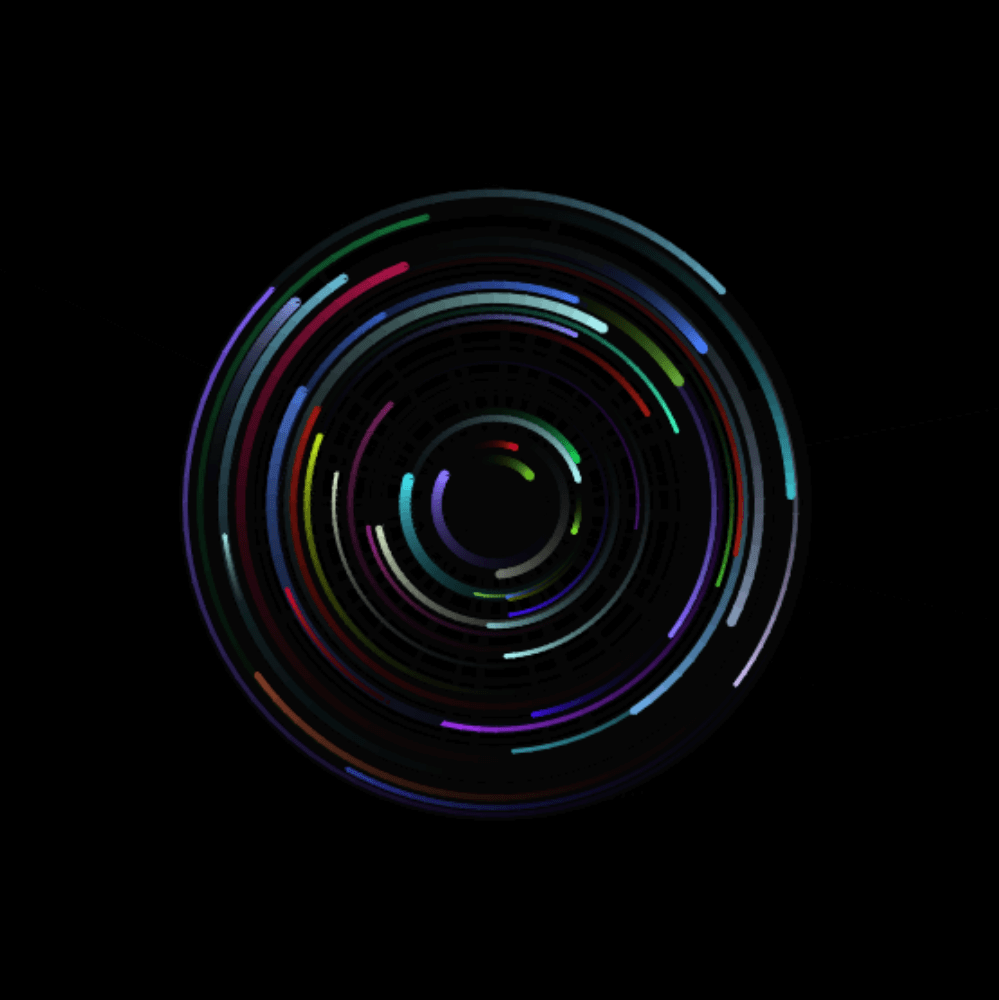

  
  

Using what I learned in my Graphical User Interfaces class (COMP 86) to implement a simple canvas that renders particles to orbit the user's mouse.

Project [here](https://will-hodge.github.io/mouseOrbs/).

Project repository <a href="https://github.com/will-hodge/mouseOrbs"><i class="large github icon "></i>here</a>.
